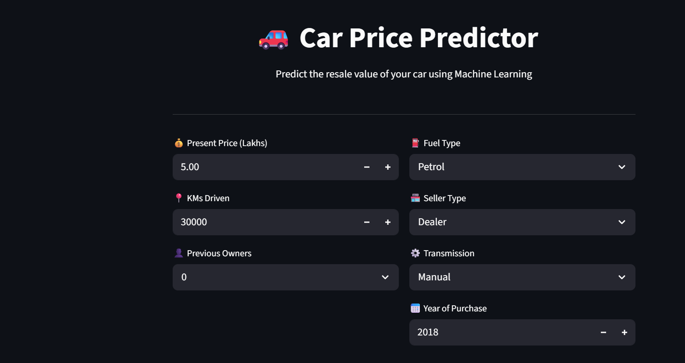
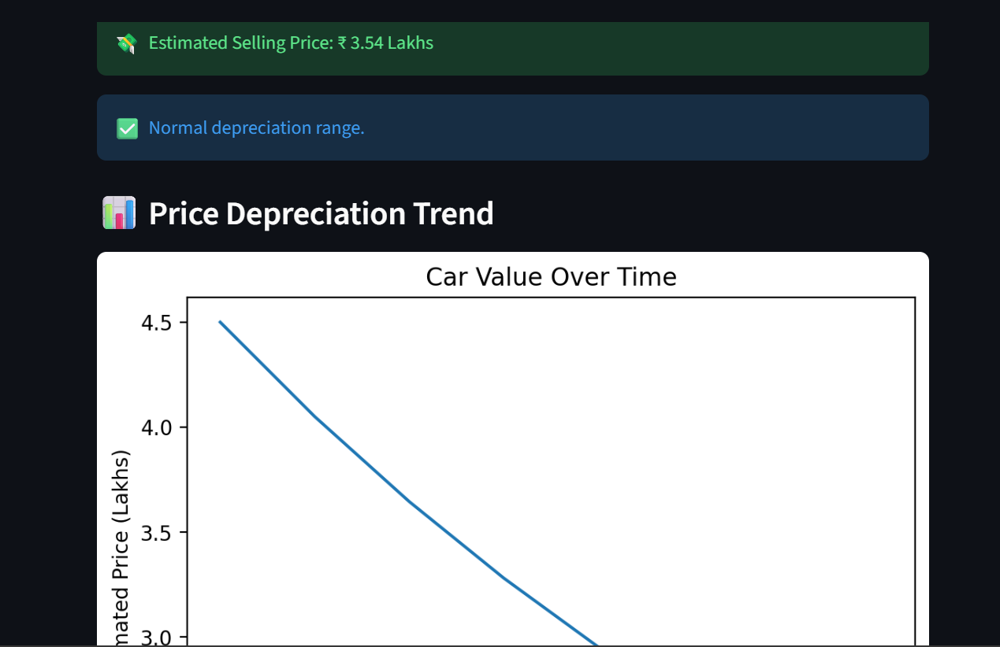

# 🚗 Car Price Prediction App


---

## 📌 Overview

This project is a Machine Learning-based web application that predicts the **selling price of used cars** based on multiple features.

It uses a **Random Forest Regressor** and is deployed as an interactive web app.

---

## 🚀 Live Demo

🔗 https://shadowfox2-sqtzqwuntgn3kyhuebywxs.streamlit.app/

---

## 🧠 Machine Learning Model

* Algorithm: Random Forest Regressor
* R² Score: ~0.96
* Mean Absolute Error: ~0.63

---

## 📊 Features Used

* Present Price
* KMs Driven
* Number of Previous Owners
* Fuel Type
* Seller Type
* Transmission
* Car Age

---

## 🖥️ Application Screenshots

### 🏠 Home Page



### 📈 Prediction Output



---

## ⚙️ Tech Stack


---

## ▶️ Run Locally

```bash
git clone https://github.com/mahekshaik147/Shadowfox2.git
cd Shadowfox2
pip install -r requirements.txt
streamlit run app.py
```

---

## 📌 Future Improvements

* Add car brand/model
* Improve UI/UX
* Add real-time pricing API
* Deploy with custom domain

---

